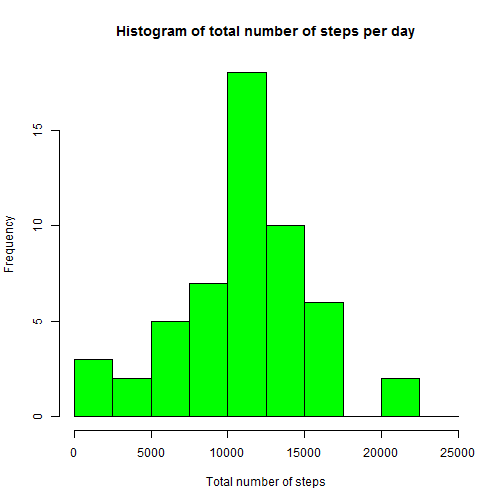
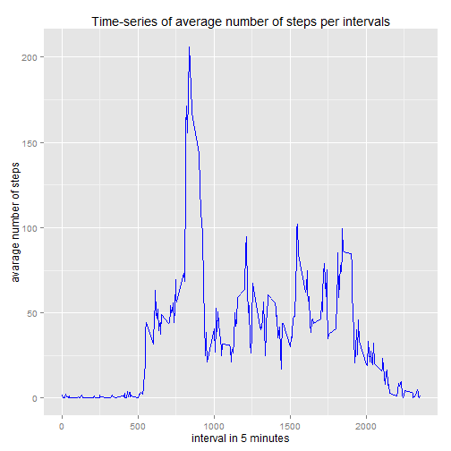
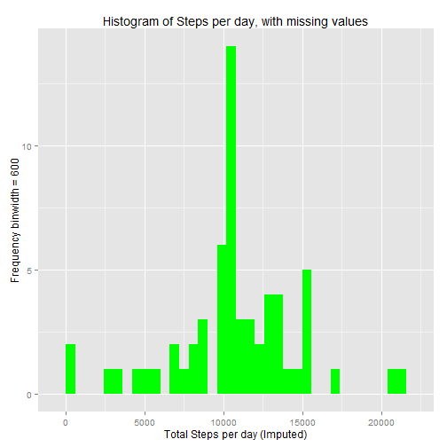
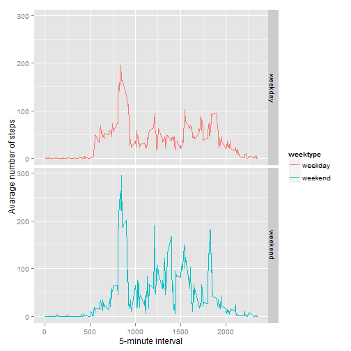

# Reproducible Research Peer Assessment 1

## Introduction
The purpose of this assignment is to write a single R markdown document that can be processed by knitr and transformed into an HTML file. This R markdown document contain results from Peer Assessment 1 in the Rerpoducible Rsearch course in Cousera.

## Data
The dataset consists of 17,568 observations and 3 variables that is steps,date and interval. The data was collected over two months period from October to November in the year of 2012. The data was measured using a personal activity monitoring device measuring the steps of individual after every 5 minutes each day.

The data for this assignment can be downloaded from the course web site:

* Dataset: [Activity monitoring data][1] [52k]

[1]: https://d396qusza40orc.cloudfront.net/repdata%2Fdata%2Factivity.zip "Activity monitoring data"

## loading Packages


```r
library(dplyr)
library(lubridate)
library(ggplot2)
```


## Loading and preprocessing the data

**1. Loading and Reading data**


```r
setwd("~/COURSERA/RR/data")
if (!file.exists("activity.csv")) {
  unzip("activity.zip")
}

activity<-read.csv("activity.csv")

act<- tbl_df(activity)
```

**2. Process and transforming the data**


```r
act<-act%>%
  mutate(date1=ymd(date))%>%
  print()
```

```
## Source: local data frame [17,568 x 4]
## 
##    steps       date interval      date1
##    (int)     (fctr)    (int)     (time)
## 1     NA 2012-10-01        0 2012-10-01
## 2     NA 2012-10-01        5 2012-10-01
## 3     NA 2012-10-01       10 2012-10-01
## 4     NA 2012-10-01       15 2012-10-01
## 5     NA 2012-10-01       20 2012-10-01
## 6     NA 2012-10-01       25 2012-10-01
## 7     NA 2012-10-01       30 2012-10-01
## 8     NA 2012-10-01       35 2012-10-01
## 9     NA 2012-10-01       40 2012-10-01
## 10    NA 2012-10-01       45 2012-10-01
## ..   ...        ...      ...        ...
```

```r
str(act)
```

```
## Classes 'tbl_df', 'tbl' and 'data.frame':	17568 obs. of  4 variables:
##  $ steps   : int  NA NA NA NA NA NA NA NA NA NA ...
##  $ date    : Factor w/ 61 levels "2012-10-01","2012-10-02",..: 1 1 1 1 1 1 1 1 1 1 ...
##  $ interval: int  0 5 10 15 20 25 30 35 40 45 ...
##  $ date1   : POSIXct, format: "2012-10-01" "2012-10-01" ...
```

```r
dim(act)
```

```
## [1] 17568     4
```

## What is the mean total number of steps taken per day?

**1. Calculating the total number of steps taken per day**


```r
act%>%
  group_by(date)%>%
  summarise(sum(steps))%>%
  print()
```

```
## Source: local data frame [61 x 2]
## 
##          date sum(steps)
##        (fctr)      (int)
## 1  2012-10-01         NA
## 2  2012-10-02        126
## 3  2012-10-03      11352
## 4  2012-10-04      12116
## 5  2012-10-05      13294
## 6  2012-10-06      15420
## 7  2012-10-07      11015
## 8  2012-10-08         NA
## 9  2012-10-09      12811
## 10 2012-10-10       9900
## ..        ...        ...
```

**2. Plotting a histogram of the total number of steps taken each day**

```r
actstep<-act%>%
  filter(!is.na(steps))%>%
  group_by(date)%>%
  summarise(steps=sum(steps))%>%
  print()
```

```
## Source: local data frame [53 x 2]
## 
##          date steps
##        (fctr) (int)
## 1  2012-10-02   126
## 2  2012-10-03 11352
## 3  2012-10-04 12116
## 4  2012-10-05 13294
## 5  2012-10-06 15420
## 6  2012-10-07 11015
## 7  2012-10-09 12811
## 8  2012-10-10  9900
## 9  2012-10-11 10304
## 10 2012-10-12 17382
## ..        ...   ...
```

```r
hist(actstep$steps, 
     breaks=seq(from=0, to=25000, by=2500),
     col="green", 
     xlab="Total number of steps", 
     ylim=c(0, 18), 
     main="Histogram of total number of steps per day")
```

 

**3. Calculating the mean and median total number of steps taken per day**


```r
summarise(actstep,meanstep=mean(steps),medianstep=median(steps))
```

```
## Source: local data frame [1 x 2]
## 
##   meanstep medianstep
##      (dbl)      (int)
## 1 10766.19      10765
```

 * The mean is 10766.19 and the median is 10765
 
## What is the average daily activity pattern?

**1. Time series plot  of the 5-minute interval (x-axis) and the average number of steps taken, averaged across all days (y-axis)**

    a) Data Manipulation

```r
actint <- act %>%
  filter(!is.na(steps)) %>%
  group_by(interval) %>%
  summarize(steps = mean(steps))%>%
  print()
```

```
## Source: local data frame [288 x 2]
## 
##    interval     steps
##       (int)     (dbl)
## 1         0 1.7169811
## 2         5 0.3396226
## 3        10 0.1320755
## 4        15 0.1509434
## 5        20 0.0754717
## 6        25 2.0943396
## 7        30 0.5283019
## 8        35 0.8679245
## 9        40 0.0000000
## 10       45 1.4716981
## ..      ...       ...
```

```r
  dim(actint)
```

```
## [1] 288   2
```

```r
  str(actint)
```

```
## Classes 'tbl_df', 'tbl' and 'data.frame':	288 obs. of  2 variables:
##  $ interval: int  0 5 10 15 20 25 30 35 40 45 ...
##  $ steps   : num  1.717 0.3396 0.1321 0.1509 0.0755 ...
```

  b) Plotting the time series plot

```r
  ggplot(actint, aes(x=interval, y=steps)) +
  geom_line(color = "blue")+
  xlab("interval in 5 minutes") + 
  ylab("avarage number of steps") +
  ggtitle("Time-series of average number of steps per intervals")
```

 


**2. Which 5-minute interval, on average across all the days in the dataset, contains the maximum number of steps?**


```r
    actint[which.max(actint$steps),]
```

```
## Source: local data frame [1 x 2]
## 
##   interval    steps
##      (int)    (dbl)
## 1      835 206.1698
```

## Imputing missing values

**1. Calculate and report the total number of missing values in the dataset**


```r
   sum(is.na(act))
```

```
## [1] 2304
```

```r
  colSums(is.na(act))
```

```
##    steps     date interval    date1 
##     2304        0        0        0
```
 
 * The number of missing value is 2304
 
**2. Devise a strategy for filling in all of the missing values in the dataset**

The strategy use for filling in the missing values or replacing the missing values in the dataset will be to calculate the means at each 5 minutes interval.

**3. Creating a new dataset equal to the original dataset but with the missing data filled in.**


```r
  impdat <- act
  misdat <- is.na(impdat$steps)
  avgbyinter <- tapply(impdat$steps,impdat$interval, mean, na.rm=TRUE, simplify = TRUE)
  impdat$steps[misdat] <- avgbyinter[as.character(impdat$interval[misdat])]
   
  head(impdat)
```

```
## Source: local data frame [6 x 4]
## 
##       steps       date interval      date1
##       (dbl)     (fctr)    (int)     (time)
## 1 1.7169811 2012-10-01        0 2012-10-01
## 2 0.3396226 2012-10-01        5 2012-10-01
## 3 0.1320755 2012-10-01       10 2012-10-01
## 4 0.1509434 2012-10-01       15 2012-10-01
## 5 0.0754717 2012-10-01       20 2012-10-01
## 6 2.0943396 2012-10-01       25 2012-10-01
```

Checking for missing values


```r
  sum(is.na(impdat$steps))
```

```
## [1] 0
```

```r
  colSums(is.na(impdat))
```

```
##    steps     date interval    date1 
##        0        0        0        0
```

* No missing values

**4. Make a histogram of the total number of steps taken each day**


```r
  datstep <- impdat %>%
  filter(!is.na(steps)) %>%
  group_by(date) %>%
  summarize(steps = sum(steps)) %>%
  print()
```

```
## Source: local data frame [61 x 2]
## 
##          date    steps
##        (fctr)    (dbl)
## 1  2012-10-01 10766.19
## 2  2012-10-02   126.00
## 3  2012-10-03 11352.00
## 4  2012-10-04 12116.00
## 5  2012-10-05 13294.00
## 6  2012-10-06 15420.00
## 7  2012-10-07 11015.00
## 8  2012-10-08 10766.19
## 9  2012-10-09 12811.00
## 10 2012-10-10  9900.00
## ..        ...      ...
```

```r
  ggplot(datstep, aes(x = steps)) +
  geom_histogram(fill = "green", binwidth = 600) +
  labs(title = "Histogram of Steps per day, with missing values", x = "Total Steps per day (Imputed)", y = "Frequency binwidth = 600")
```

 


 **Calculate and report the mean and median total number of steps taken per day.**
 

```r
   meanstep<-mean(datstep$steps)
   medianstep<-median(datstep$steps)
```

* Mean: 10766
* Median: 10766

The values do not differ from the estimates from the first part of the assignment. 

The impact of imputing missing is that both the mean and the median are equal. But there seems to be no much impact.

## Are there differences in activity patterns between weekdays and weekends?

**1. Creating a new factor variable in the dataset with two levels - "weekday" and "weekend" indicating whether a given date is a weekday or weekend day.**


```r
   impdat$weektype <- ifelse(wday(impdat$date1) %in% c(0,6), "weekend", "weekday")
```

**2. Make a panel plot containing a time series plot of the 5-minute interval (x-axis) and the average number of steps taken**


```r
   avgimpdat<- aggregate(steps ~ interval + weektype, data=impdat, mean)

   ggplot(avgimpdat, aes(interval, steps, color = weektype)) + 
    geom_line() + 
    facet_grid(weektype ~ .) +
    xlab("5-minute interval") + 
    ylab("Avarage number of steps")
```

 


 
